# Architecture Guide for the `w2` Tiny C Compiler

This document provides a deep, end‑to‑end walkthrough of the compiler architecture, the major data structures, execution pipeline, and key design decisions. It is intended for contributors adding features (operators, statements, types, backend features) or refactoring phases.

---
## 1. High‑Level Overview
`w2` compiles a single C source file (subset) into an x86‑64 macOS Mach‑O executable using the system toolchain for preprocessing and final assembly. Internally it implements: lexing, parsing, semantic validation (name resolution + type checking), a three‑address code (TAC) IR called *Tacky*, and a second assembly IR before emitting textual assembly.

Pipeline (one file at a time):
```
source.c ──(gcc -E -P)──> source.i ──lex──> Tokens ──parse──> AST ──validate──> Typed AST
          ──tacky::generate──> Tacky IR ──code::generate──> Assembly IR ──code::emit──> .s
          ──(gcc assemble+link)──> executable (or object with --compile)
```
### Mermaid Pipeline Diagram

```mermaid
flowchart LR
   subgraph Preprocessing
      A[source.c] -->|gcc -E -P| B[source.i]
   end
   B --> C[Lexer<br/>Tokens]
   C --> D[Parser<br/>AST]
   subgraph Validation
      D --> D1[Name Resolution]
      D1 --> D2[Loop Labeling]
      D2 --> D3[Type Check +<br/>Conversions]
   end
   D3 --> E[Tacky IR]
   subgraph Codegen
      E --> F1[Initial Assembly IR]
      F1 --> F2[fixup_pseudo<br/>assign stack]
      F2 --> F3[fixup_invalid<br/>mem-mem repair]
      F3 --> F4[allocate_stack]
   end
   F4 --> G[Emit Mach-O asm<br/>.s file]
   G --> H{--compile?}
   H -->|yes| I[Object .o]
   H -->|no| J[Executable]

   classDef phase fill:#1e88e5,stroke:#0d47a1,stroke-width:1,color:#fff;
   classDef sub fill:#90caf9,stroke:#1976d2,color:#0d47a1;
   class A,B,C,D,D1,D2,D3,E,F1,F2,F3,F4,G,H,I,J phase;
   class Preprocessing,Validation,Codegen sub;
```

Optional flags (`--lex`, `--parse`, `--validate`, `--tacky`, `--codegen`, `--emitcode`, `--compile`) allow early termination; `--debug` prints the artifact of each finished phase.

---
## 2. Supported C Subset
- Scalar integer types: `int` (32‑bit), `long` (64‑bit)
- Storage classes (file or block scope): `static`, `extern`
- Control flow: `if/else`, `while`, `do while`, `for`, `break`, `continue`
- Expressions: unary (~, !, -), binary arithmetic, bitwise, logical (`&&`, `||`), comparisons, assignment, compound assignment, conditional `?:`, function calls, casts `(int)`, `(long)`
- File‑scope and block‑scope variable declarations
- Function declarations/definitions with fixed arity (no varargs)

Not yet supported: pointers, arrays, structs, enums, floats, initializer lists, string literals, multiple translation units, variadic functions.

---
## 3. Core Modules
| Module | Purpose |
|--------|---------|
| `lex.rs` | Regex‑driven tokenizer; produces `Token` sequence + `Eot` terminator. |
| `parse.rs` | Precedence‑climbing expression parser + statement/declaration parser => AST (`Ast::Program`). |
| `validate.rs` | Three passes: name resolution (unique renaming & linkage), loop labeling, type checking & implicit conversion insertion. Maintains symbol/ backend tables. |
| `convert.rs` | Type promotion / implicit cast helpers and static initializer evaluation. |
| `tacky.rs` | Generates TAC (Tacky IR) from validated AST; introduces temporaries, control‑flow labels, lowers high‑level constructs. Adds static variable definitions from symbol table. |
| `code.rs` | Low‑level assembly IR generation + fixups + stack layout + emission of Mach‑O assembly text. |
| `utils.rs` | GCC subprocess helpers (preprocess, assemble/link), temp/label name generation, mini counter. |
| `main.rs` | CLI driver orchestrating phases and flag‑controlled early exits. |

---
## 4. Tokenization (`lex.rs`)
- Deterministic single pass using anchored regular expressions (all patterns start at beginning `^`).
- Distinguishes integer vs long literal by trailing `[lL]` → `LConstant`.
- Operators grouped (compound assignment, multi‑char logical/shift/relational, single‑char fallback).
- Helper predicates on `Token`:
  - `precedence()` numeric table (higher number == tighter binding)
  - `is_binary_operator()` includes `?` (handled specially) and assignments
  - `is_compound_assignment()` for transformations in parser/validator
- Whitespace skipped; no comments (preprocessor could remove them).

---
## 5. Abstract Syntax Tree (`parse.rs`)
### Expressions
Each `Expression` variant carries a `Type` (initially `Type::None` for nodes needing inference):
```
Expression::Constant(Const, Type)
Expression::Var(Identifier, Type)
Expression::Cast(Type target, Box<Expression>, Type original)
Expression::Unary(UnaryOperator, expr, Type)
Expression::Binary(BinaryOperator, lhs, rhs, Type)
Expression::Assignment(lhs, rhs, Type)
Expression::CompoundAssignment(bin_op, lhs, rhs, Type)
Expression::Conditional(cond, then, else, Type)
Expression::FunctionCall(name, Option<Vec<Expression>>, Type)
```
### Statements & Declarations
```
Statement::{Return, Expression, If, Compound(Block), Break(Label), Continue(Label),
           While(expr, body, label), DoWhile(body, expr, label),
           For(ForInit, cond?, post?, body, label), None}

Declaration::{FunDecl(FunctionDeclaration), VarDecl(VariableDeclaration)}
```
`ForInit` either a declaration or optional expression. Blocks interleave `BlockItem::S` (statement) and `BlockItem::D` (declaration).

### Types
```
Type::{Int, Long, FunType(Vec<Type>, Box<Type>), None}
```
### Parsing Strategy
- Precedence climbing in `parse_expression(min_precedence)`.
- Special handling for: assignment (right associative via same precedence), compound assignment (parse as binary operator + marker), ternary `?:` (middle expression parsed by helper), function calls, casts `(int)` / `(long)`, unary chain via recursion.
- Type and storage specifiers collected into `Specifier` before building var/function declarations.
- No lookahead buffering beyond `Peekable` iterator; parentheses drive disambiguation for casts vs grouping.

---
## 6. Validation (`validate.rs`)
Three conceptual passes over `Ast::Program`:
1. **Name Resolution**
   - Builds `IdentMap` for scopes; file scope variables retain original name; local variables get unique temp suffix via `temp_name`.
   - Function parameters & local declarations become unique, enabling simple backend uniqueness.
   - Checks for conflicting redeclarations (scope + linkage rules).
2. **Loop Labeling**
   - Assigns fresh labels to loops; rewrites `Break` / `Continue` to carry the loop label for TAC lowering.
3. **Type Checking**
   - Consults `SYMBOLS` thread‑local `SymbolTable` mapping identifier → `Symbol { symbol_type, attrs }`.
   - Inserts implicit conversions by wrapping expressions in `Expression::Cast` when result types differ.
   - Defines rules:
     - Arithmetic / bitwise binary: common type (promote to `long` if mismatch)
     - Comparisons / logical operators yield `int`
     - Assignment: RHS converted to LHS type
     - Conditional `?:` branches converted to common type
     - Unary `!` yields `int` else propagate operand type
   - File‑scope statics tracked with `InitialValue::{Initial, Tentative, NoInitializer}` for later emission.

### Symbol & Backend Tables
```
SymbolTable: HashMap<Identifier, Symbol>
Symbol: { symbol_type: Type, attrs: IdentAttrs }
IdentAttrs::{Function(defined, global), Static(InitialValue, global), Local}
BackendTable: Populated later (object/func metadata for codegen)
```
Thread locals allow side‑effecting population during deeper passes without passing contexts around.

---
## 7. Type Conversion Helpers (`convert.rs`)
- `get_common_type(a,b)`: currently a simple rule (if unequal → Long) – placeholder for full usual arithmetic conversions.
- `convert_to(expr, target_type)`: returns `expr` unchanged if types match, else wraps in a `Cast`.
- `convert_static_init`: validates that a static initializer is a constant and normalizes default zero initializers.
- `val_type(Val)` chooses `AssemblyType::{Longword, Quadword}` depending on variable’s semantic type (int vs long), used by assembly lowering.

---
## 8. Tacky IR (`tacky.rs`)
### Values & Instructions
```
Val::{Constant(Const), Var(String)}
Instruction::{SignExtend, Truncate, Return, Unary, Binary, Copy,
             Jump, JumpIfZero, JumpIfNotZero, Label, FunCall}
Function(name, global, params?, instructions?)
StaticVariable(name, global, Type, StaticInit)
```
### Generation Principles
- One temporary per intermediate result (`temp_name`), registered in symbol table as local so later type width queries succeed.
- Control flow lowered explicitly with labels:
  - `if`/`else`: conditional jump to else label, unconditional jump to end
  - Short‑circuit `&&` / `||`: structured as early out branches writing final 0/1 result temp
  - Loops: labeling via `mklabel("break", loopLabel)` / `mklabel("continue", loopLabel)` – inserted in Validate phase
  - Conditional operator `?:`: two branches writing into a unified result temp
- Implicit `Return(ZERO)` appended if function body has no explicit return.
- Static and tentative file‑scope variables appended as `Definition::VarDef` after translating functions.

### Separation of Concerns
Tacky is still typed (via symbol table) but does not encode types directly in instruction variants; width decisions deferred to `code.rs` using `val_type`.

---
## 9. Assembly IR (`code.rs`)
### IR Layers
```
Operand::{Imm(i64), Reg(Register), Pseudo(Identifier), Stack(offset), Data(label)}
Instruction::{Mov, Movsx, Unary, Binary, Cmp, Idiv, Cdq,
             Jmp, JmpCC, SetCC, Label, Push, Call, Ret}
Definition::{FunDef(Function( name, global, stackSize, instructions? )),
             VarDef(StaticVariable(name, global, alignment, StaticInit))}
```
### Generation Steps
1. **Initial Lowering** (`tacky_to_assembly`) – straight mapping; still contains `Pseudo` operands and some illegal mem→mem instructions.
2. **Function Call Handling**
   - System V style first 6 args in registers: `%rdi,%rsi,%rdx,%rcx,%r8,%r9` (mapped in `ARG_REGISTERS`).
   - Remaining args pushed right‑to‑left. If odd count (ensuring 16‑byte alignment), pad stack by 8.
   - Return value always in `%rax` → moved into destination pseudo.
3. **Fixup Pseudo** (`fixup_pseudo`)
   - Assigns each pseudo temp a negative stack offset in 16‑byte aligned frame.
   - Distinguishes globals/statics (→ `Data` operand with `_%name(%rip)`) from locals (stack).
4. **Fixup Invalid** (`fixup_invalid`)
   - Expands illegal memory→memory forms by moving via scratch registers `%r10/%r11` or shift count `%rcx`.
5. **Stack Allocation** (`allocate_stack`)
   - Inserts prologue stack adjustment if needed (`subq $N, %rsp` before body; epilogue handled in `Ret` emission).
6. **Emission** (`emit`) – prints Mach‑O assembly:
   - Prefix global symbol names with underscore.
   - Section layout: `__TEXT,__text` + `.data` / `.bss` for statics; simple alignment rules from `AssemblyType`.

### Operators
- 32‑bit ALU ops intentionally used (`movl`, `addl`, etc.) relying on zero/sign extension semantics of x86‑64 for long results where needed via explicit `SignExtend` / `Truncate` tacky instructions → `movsx` / size‑restricted `movl` sequence.

---
## 10. Control Flow Lowering Patterns
| Construct | Pattern |
|-----------|---------|
| `if (c) S;` | test c → `JumpIfZero end` → body → `Label end` |
| `if (c) S1 else S2` | test c → `JumpIfZero else` → S1 → `Jump end` → `Label else` → S2 → `Label end` |
| `while (c) S` | `Label continue` → test c → `JumpIfZero break` → S → `Jump continue` → `Label break` |
| `do S while(c);` | `Label loop` → S → `Label continue` → test c → `JumpIfNotZero loop` → `Label break` |
| `for(init; c; post) S` | emit init → `Label loop` → optional test → break label → body → `Label continue` → post → `Jump loop` → `Label break` |
| `a && b` | eval a → if zero jump false → eval b → copy 1 → jump end → `Label false` → copy 0 → `Label end` |
| `a || b` | eval a → if nonzero jump true → eval b → if nonzero jump true → copy 0 → jump end → `Label true` → copy 1 → `Label end` |
| `c ? x : y` | eval c → `JumpIfZero else` → eval x → copy → `Jump end` → `Label else` → eval y → copy → `Label end` |

---
## 11. Calling Convention
- Arguments 0..5 in `%rdi,%rsi,%rdx,%rcx,%r8,%r9` (32‑bit views for int). Remaining pushed (8 bytes each).
- Caller ensures 16‑byte alignment prior to `call` (padding logic in `convert_function_call`).
- Return value always in `%rax` (moved out to pseudo destination variable immediately).
- No callee-saved register management yet—compiler avoids using non-volatile registers besides `%rbp` frame anchor.

---
## 12. Static & Global Variables
- File scope declarations processed during validation: track linkage (extern vs static) and initialization state (initial / tentative / no initializer).
- During `tacky::generate`, symbol table scanned and each static (or tentative) becomes a `VarDef` with either explicit initializer or zero.
- Emission chooses `.data` vs `.bss` depending on whether initializer is zero. Alignment derived from size (4 for int / 8 for long).

---
## 13. Memory & Stack Layout
- Base pointer `%rbp` saved; locals and temporaries assigned negative offsets aligned to 16 bytes overall.
- Temporaries sized as 4 bytes (int semantics) unless sign–extension indicates 64‑bit usage at instruction level.
- No spill optimization or live range analysis; every pseudo gets a distinct slot.

---
## 14. Temporary Naming & Labels
- `temp_name(prefix)` produces `prefix.N` monotonically increasing (thread‑local counter).
- Loop labeling: for each loop a unique base (e.g. `while.17`), with synthetic `continue_...` / `break_...` labels via `mklabel`.
- Predictable names help debugging intermediate dumps with `--debug`.

---
## 15. Error Handling Strategy
- Use `anyhow::Result<T>`; unrecoverable semantic issues reported with `bail!(...)`.
- Phases are fail‑fast; later phases assume invariants:
  - All identifiers resolved to unique backend names.
  - Expression types assigned (non‑`Type::None`) except during parsing.
  - Only valid lvalues appear on LHS of assignment or compound assignment.

---
## 16. CLI Driver (`main.rs`)
Flag processing sets boolean stage gates. For each input file:
1. Preprocess to `.i`
2. Lex → optional exit
3. Parse → optional exit
4. Validate → optional exit
5. Generate Tacky → optional exit
6. Generate Assembly IR → optional exit
7. Emit assembly → optional exit
8. Assemble+link (`--compile` chooses object vs executable)
`--debug` prints each artifact struct/enum debug representation.

---
## 17. Testing Harness
- Upstream chapter tests live in the `writing-a-c-compiler-tests` git submodule.
- Setup/update helpers are in `Makefile`: `make test-init`, `make test-update`, `make test-status`.
- Script: `w2test.sh` wraps upstream `writing-a-c-compiler-tests/test_compiler` runner.
- Environment variables: `CHAPTER` (required), `STAGE` (optional). Harness invokes built `target/debug/w2` with appropriate stage flag.
- Stage names correlate to CLI flags (minus leading dashes).

---
## 18. Extension Checklist
When adding a new language feature/operator:
1. Lexer: add token + regex (ensure precedence table updated if operator).
2. Parser: accept new token in factor/unary/binary logic; update AST variants if needed.
3. Validation: add type rules, name resolution adjustments, loop labeling (if new control flow), storage/linkage constraints.
4. Conversion: adapt `get_common_type` / conversion rules if type set expands.
5. TAC Generation: lower new AST constructs; introduce new instruction forms if necessary (keep them simple, three‑address style where possible).
6. Assembly Lowering: map new TAC instructions → assembly; update fixups if new invalid patterns arise.
7. Tests: add chapter / stage tests mirroring upstream style.
8. Docs: update `AGENTS.md` + this architecture doc if semantics changed.

For new data types (e.g., pointers):
- Expand `Type` enum
- Add size/alignment logic and `AssemblyType` mapping
- Adjust `val_type`, static initializer logic, and comparison semantics

---
## 19. Limitations & Future Work
- No pointer / array / struct support
- No constant folding or dead code elimination
- Very naive register allocation (all temps on stack)
- `get_common_type` is oversimplified
- No diagnostic location tracking (preprocessor strips line directives)
- Only integer arithmetic; division/modulo rely on sign extension patterns (no unsigned distinction)
- No separate compilation / multiple translation units

Potential future enhancements: pointer arithmetic, basic SSA or liveness + register allocation, constant folding, richer type system, debug info emission, improved error messages with source spans.

---
## 20. Glossary
- **AST**: Abstract Syntax Tree representing parsed high-level constructs.
- **Tacky (TAC)**: Three‑Address Code intermediate representation; linear, low‑level, still typed via symbol table.
- **Pseudo (Operand)**: Placeholder symbolic location before stack slot or global resolution.
- **Static (file scope)**: Variable with internal or external linkage depending on storage class.
- **Tentative Definition**: File‑scope variable with no initializer (may be merged with others, zero‑initialized).
- **Fixup**: Transformation pass cleaning invalid memory operations or assigning storage.

---
## 21. Quick Data Structure Reference
```
Token::{Identifier(String), Constant(String), ... , PlusAssign, ... , Eot}
Type::{Int, Long, FunType(Vec<Type>, Box<Type>), None}
Symbol::{ symbol_type: Type, attrs: IdentAttrs }
IdentAttrs::{Function(defined,bool global), Static(InitialValue,bool global), Local}
Val::{Constant(Const), Var(String)}
Assembly Operand::{Imm, Reg, Pseudo, Stack, Data}
```

---
## 22. Design Rationale Highlights
- **Unique renaming early**: simplifies later passes; TAC & assembly do not worry about lexical scopes.
- **32‑bit ALU by default**: simpler and consistent; explicit sign/zero conversion expressed in IR.
- **Two IRs (Tacky + Assembly)**: separation keeps lowering steps clear and localized; easier to test.
- **Thread‑local symbol tables**: avoid passing large mutable contexts; cost acceptable for single‑threaded pipeline.

---
## 23. Getting Oriented Quickly
1. Run with `--debug --tacky` to see TAC for a small program.
2. Skim `tacky.rs` to understand control‑flow canonicalization.
3. Inspect emitted assembly vs TAC to map common patterns (e.g., short circuiting).
4. Explore `validate.rs` for naming & type invariants—most semantic constraints live there.

---
## 24. Contributing Tips
- Keep patches minimal and focused.
- Preserve ordering in large `match` expressions—add `#[rustfmt::skip]` when alignment is intentional.
- Update docs and tests with any externally visible semantic change.
- Prefer explicit pattern matches over `_` for future proofing (except where enumeration is exhaustive by construction).

---
*End of Architecture Guide.*
